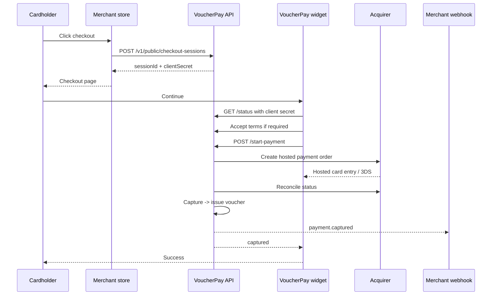

VoucherPay is a checkout and voucher operations layer for merchants.

## Parties

| Party | Role |
| --- | --- |
| Cardholder | The customer buying from your store. |
| Merchant | Your business. You own the order and the customer relationship. |
| VoucherPay | Creates sessions, gates checkout, tracks acquirer state, issues vouchers, and manages merchant balances. |
| Acquirer | Hosts card entry and 3DS, then reports payment state back to VoucherPay. |

## Main objects

| Object | Created by | Meaning |
| --- | --- | --- |
| Checkout session | Merchant backend | One payment attempt for one store order. |
| Client secret | VoucherPay | Browser-safe secret for one checkout session. |
| Terms acceptance | Cardholder via widget | Evidence that the cardholder accepted the bound terms version. |
| Voucher | VoucherPay | Receipt-like value record issued after capture. |
| Webhook event | VoucherPay | Signed notification to your backend. |
| Payout destination | Merchant portal | Approved bank or wallet destination for withdrawals. |
| Withdrawal | Merchant portal | Request to move available value out of VoucherPay. |

## Session lifecycle

## Merchant identity is fixed at session creation

VoucherPay identifies the merchant when your backend creates the checkout session with your merchant API key. The cardholder must already be buying from a known merchant before card entry or 3DS begins.

Do not create generic payments and decide the merchant later.

## Voucher lifecycle

The normal happy path:

1. Payment is captured.
2. Voucher is issued.
3. Voucher value is funded and allocated to merchant books.
4. Holds or reserves are applied if configured.
5. Available value can be withdrawn to an approved payout destination.

Voucher availability can be affected by settlement delay, reserve, chargeback holds, payout destination approval, and operational review.
